# Producto de prueba

Este desarrollo contiene 2 carpetas, una de express y otra de react.

## React
Maneja toda la lógica de la aplicación front.

### Instalar
Entramos a la carpeta por consola y ejecutamos:

    npm install

### Ejecutar
Entramos a la carpeta por consola y ejecutamos:

    npm start

## Express
Maneja solo la api

### Instalar
Entramos a la carpeta por consola y ejecutamos:

    npm install

### Ejecutar
Entramos a la carpeta por consola y ejecutamos:

    npm start

### Rutas
Tiene dos apis:

La primera enfocada a buscar productos, solo muestra 4:

    http://localhost:13000/item?search=palabra

La segunda para mostrar un producto especifico

    http://localhost:13000/item/:id

## UML diagrams

Integracion de react, express y el api

```mermaid
graph LR
A[React:3000] -- Petición Get --> B((Express api:13000))
B -- Petición Get--> D{Api Mercado Libre}
D -- Respuesta Get--> B
B -- Respuesta Get--> A
```

## Importante
Debido a la politica de cors es IMPORTANTE que react corra como localhost:3000, esto debido a que esta es la politica de CORS que se coloco en expres, de lo contrario saldra ERROR 
